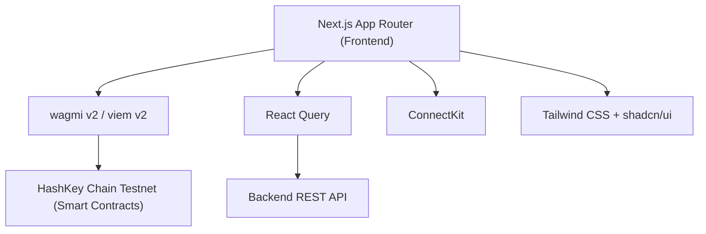

## 1. Architecture Design

## 2. Technology Description
- **Frontend**: Next.js 14 (App Router) + TypeScript + Tailwind CSS
- **Wallet Integration**: wagmi v2 + viem v2 + ConnectKit
- **UI Components**: shadcn/ui (radix-ui primitives)
- **State Management**: @tanstack/react-query
- **Charts**: recharts
- **Icons**: lucide-react

## 3. Route Definitions
| Route | Purpose |
|-------|---------|
| `/` | Pool Dashboard with live stats, price chart, and recent swaps |
| `/swap` | Swap interface (USDC ↔ RWA) with TradeGuard integration and KYC gating |
| `/liquidity` | Manage LP position, direct deposit, PayFi checkout, and auto-invest setup |
| `/history` | Paginated transaction history (Swaps, Liquidity, PayFi) |

## 4. API Definitions (Interacting with existing Backend)
- `GET /api/pool/state`: Returns `{ rwaReserve, usdcReserve, spreadBps, feeBps, accumulatedFees, oraclePrice, timestamp }`
- `GET /api/pool/price-history?token=0x...&from=7daysago`: Returns `[{ timestamp, price }]`
- `GET /api/pool/swaps`: Returns `[{ time, user, direction, amountIn, amountOut, price, txHash }]`
- `GET /api/user/estimate-swap?tokenIn=...&amountIn=...`: Returns `{ estimatedOut, effectivePrice, fee, spreadCost }`
- `GET /api/kyc/check?address=...`: Returns `{ level, levelName, canSwap, canProvideLiquidity, kycPortalUrl }`
- `GET /api/user/position?address=...`: Returns `{ sharesOwned, shareValueUsdc, poolOwnershipPct, pendingYield }`
- `POST /api/payfi/checkout`: Body `{ amount, userAddress }`, Returns `{ payment_url, payment_request_id, order_id }`
- `POST /api/payfi/reusable`: Body `{ amount, userAddress }`, Returns `{ payment_url, payment_request_id, order_id }`
- `GET /api/history/swaps?address=...`: Returns paginated swap history.
- `GET /api/history/liquidity?address=...`: Returns paginated liquidity history.
- `GET /api/payfi/history?address=...`: Returns `[{ date, flow, amount, status, mandateId }]`

## 5. Smart Contract Integration
- **Contracts**: `RWAPool`, `TradeGuard`, `PriceOracle`, `KYCRegistry`
- **Actions**:
  - `addLiquidity(rwaAmount, stableAmount)`
  - `removeLiquidity(shares)`
  - `swapRWAForStable(rwaAmountIn, minStableOut)`
  - `swapStableForRWA(stableAmountIn, minRwaOut)`
  - `claimYield()`
  - `TradeGuard.commitSwap(isStableToRWA, amountIn, minAmountOut)`
  - `TradeGuard.executeSwap(commitmentId)`
  - `TradeGuard.cancelSwap(commitmentId)`

## 6. Development Constraints
- Strictly adhere to a dark theme with a clean, institutional finance aesthetic.
- Components must be robust and error states handled gracefully.
- Responsive design is mandatory.
- Re-use existing `04_frontend.md` specifications to build components accurately.
- `wagmiConfig` must use `hashkeyTestnet` natively.
- Use `useKYCStatus` hook globally to conditionally render features or the `KYCGate` component.