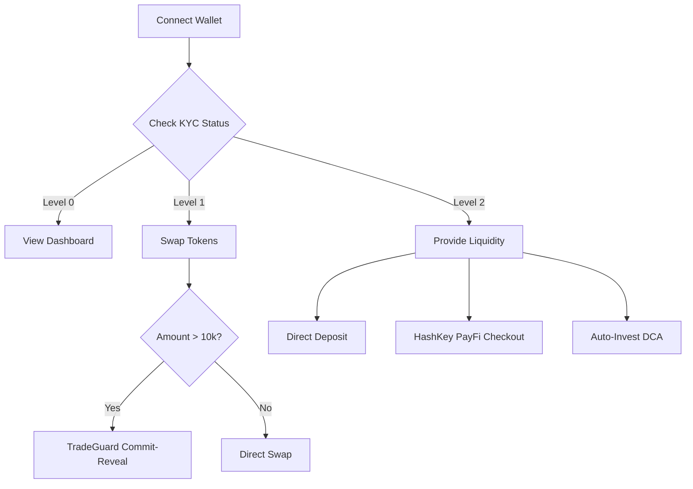

## 1. Product Overview
RWA Liquidity Hub Frontend (Module 4) for HashKey Chain Horizon Hackathon.
- A single-page dApp providing an institutional-grade interface for liquidity provision and RWA swaps.
- Integrates direct DeFi interactions, HashKey PayFi Gateway (Checkout/Auto-Invest DCA), and KYC compliance gating.

## 2. Core Features

### 2.1 User Roles
| Role | Registration Method | Core Permissions |
|------|---------------------|------------------|
| Unverified User | Wallet Connection | View pool dashboard, read-only access |
| Basic KYC User | HashKey KYC Portal | Swap tokens |
| Advanced KYC User | HashKey KYC Portal | Provide liquidity, use PayFi features |

### 2.2 Feature Module
1. **Pool Dashboard**: Live pool state, oracle price, reserves, price history chart, recent swaps.
2. **Swap**: Token exchange with real-time preview, KYC gate, TradeGuard commitment flow for large trades.
3. **Liquidity**: Direct deposit, HashKey PayFi checkout, Auto-Invest (DCA), remove liquidity, claim yield.
4. **History**: Paginated history of swaps, liquidity events, and PayFi mandate IDs.

### 2.3 Page Details
| Page Name | Module Name | Feature description |
|-----------|-------------|---------------------|
| Dashboard | Pool Stats | Shows live oracle price, reserves, spread, and accumulated fees. |
| Dashboard | Price Chart | 7-day NAV history of the RWA bond. |
| Swap | Swap Form | Real-time output preview, spread cost, and execution path routing (Direct vs TradeGuard). |
| Swap | KYC Gate | Inline component blocking actions based on wallet KYC level. |
| Swap | TradeGuard Flow | 2-step commit-reveal process for swaps > 10,000 USDC. |
| Liquidity | LP Position | Current shares, USD value, pool ownership %, and pending yield. |
| Liquidity | HashKey Checkout | Web2.5 fiat/crypto onramp via HashKey Merchant API. |
| Liquidity | Auto-Invest | Subscribe to recurring USDC deposits (reusable mandates). |
| History | History Tabs | Tables for Swaps, Liquidity, and PayFi events linking to Blockscout. |

## 3. Core Process
The user connects their wallet and their KYC status is verified. They can explore the Pool Dashboard. If they meet KYC requirements, they can perform Swaps (routed through TradeGuard if large) or provide Liquidity (directly via smart contracts or through HashKey PayFi Gateway). They can track all activities in the History tab.

## 4. User Interface Design
### 4.1 Design Style
- **Theme**: Dark theme, clean finance style design.
- **Colors**: Deep dark backgrounds (e.g., `#0A0A0A`), crisp white text, institutional blue/green accents for positive actions, subtle grays for secondary info.
- **Typography**: Refined, modern sans-serif (e.g., Inter or a premium alternative like Geist/Space Grotesk) with tabular numbers for financial data.
- **Layout**: Card-based, spacious, highly structured grids with clear visual hierarchy.
- **Components**: Minimalist borders, subtle glowing hover effects, frosted glass (backdrop-blur) elements for modals and overlays.

### 4.2 Page Design Overview
| Page Name | Module Name | UI Elements |
|-----------|-------------|-------------|
| Global | Navigation & Wallet | Top bar with logo, nav links, and ConnectKit button. Persistent KYC banner if needed. |
| Dashboard | Stats Grid | 4-column metric cards with subtle borders and glowing accents. |
| Dashboard | Chart | Clean line chart with gradient fill under the line, custom tooltip. |
| Swap | Swap Interface | Centered, sleek card. Inputs with large typography for amounts. Inline KYC gate with lock icon. |
| Liquidity | Position & Actions | Split layout: Left shows current position/yield, Right shows deposit/PayFi actions. |
| History | Data Tables | Minimalist tables with monospace numbers, colored badges for transaction types. |

### 4.3 Responsiveness
- Desktop-first design optimized for complex financial dashboards.
- Mobile-adaptive with stacked cards and responsive tables (horizontal scrolling or card-based list on mobile).
- Touch-friendly inputs and buttons.